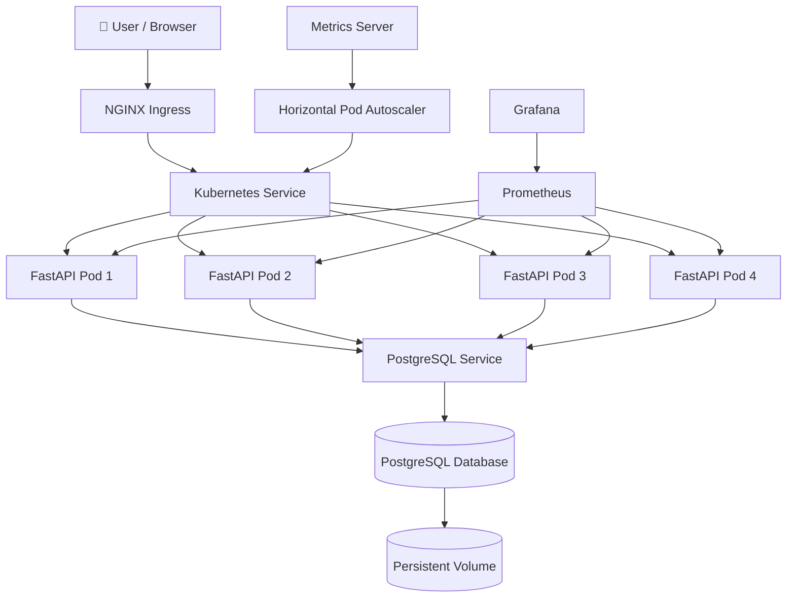
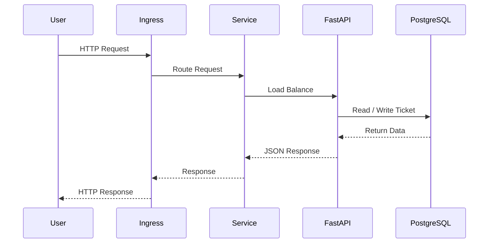
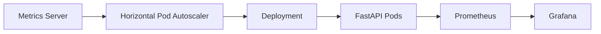

# Cloud Ticket Management System

> **A production-inspired cloud-native support ticket management platform built with FastAPI, Docker, Terraform, Kubernetes, Prometheus, Grafana, Helm, and GitHub Actions.**

<p align="center">


</p>

---

# Project Overview

Cloud Ticket Management System is a production-inspired cloud-native application that demonstrates the complete lifecycle of modern application development, deployment, orchestration, monitoring, and packaging.

The project began as a RESTful Support Ticket API developed using FastAPI and PostgreSQL, and was progressively transformed into a cloud-native platform using Docker, Terraform, Kubernetes, Prometheus, Grafana, Helm, and GitHub Actions.

Rather than focusing solely on backend development, this project emphasizes how modern applications are built, deployed, monitored, scaled, and maintained using contemporary DevOps and Cloud Engineering practices.

The application demonstrates Infrastructure as Code (IaC), containerization, Kubernetes orchestration, automated scaling, production-style ingress routing, observability, monitoring, and deployment automation within a single end-to-end project.

---

# Why This Project?

Modern software engineering extends far beyond writing application code. Production applications must also be:

* Containerized
* Deployed reliably
* Scalable
* Observable
* Highly available
* Easy to maintain
* Infrastructure-driven
* Cloud-ready

This project was designed to demonstrate the complete cloud-native software delivery lifecycle while following engineering practices commonly used in modern technology organizations.

---

# Key Features

### Backend

* RESTful API built with FastAPI
* PostgreSQL database integration
* CRUD operations for support tickets
* Environment-based configuration

### Containerization

* Dockerized FastAPI application
* Docker Compose for local development
* Multi-container application architecture

### Infrastructure as Code

* AWS infrastructure provisioned using Terraform
* Automated EC2 provisioning
* Security Group configuration
* SSH key management

### Kubernetes

* Deployments
* Services
* Persistent Volume Claims
* Secrets
* Readiness Probes
* Liveness Probes
* Ingress
* Rolling Updates
* Self-Healing
* Horizontal Pod Autoscaler (HPA)

### Monitoring & Observability

* Prometheus metrics collection
* Grafana dashboards
* Kubernetes Metrics Server
* CPU and Memory monitoring

### Packaging & Automation

* Helm chart packaging
* GitHub Actions CI pipeline
* Infrastructure automation
* Kubernetes manifest management

---

# Technology Stack

| Category         | Technologies                        |
| ---------------- | ----------------------------------- |
| Backend          | FastAPI, Python                     |
| Database         | PostgreSQL                          |
| Containerization | Docker, Docker Compose              |
| Infrastructure   | Terraform, AWS EC2                  |
| Orchestration    | Kubernetes                          |
| Networking       | Kubernetes Services, Ingress        |
| Monitoring       | Prometheus, Grafana, Metrics Server |
| Packaging        | Helm                                |
| Version Control  | Git, GitHub                         |
| CI/CD            | GitHub Actions                      |

---

# Repository Structure

```text
support-ticket-api/
│
├── .github/                 # GitHub Actions workflows
├── app/                     # FastAPI application source code
├── docs/                    # Project documentation
├── helm/                    # Helm chart
├── infra/                   # Terraform infrastructure
├── k8s/                     # Kubernetes manifests
│
├── Dockerfile
├── docker-compose.yml
├── requirements.txt
├── README.md
└── CHANGELOG.md
```

# 🏗️ System Architecture

The Cloud Ticket Management System follows a modern cloud-native architecture that separates application logic, networking, orchestration, monitoring, and infrastructure into independent layers. Each component has a well-defined responsibility, making the platform scalable, resilient, and easy to maintain.

---

## Overall Cloud Architecture



---

## Application Request Flow

Every client request follows the workflow below.

1. A client sends an HTTP request.
2. The NGINX Ingress Controller receives the request.
3. The Ingress routes traffic to the Kubernetes Service.
4. The Service distributes traffic across available FastAPI pods.
5. The selected pod processes the request.
6. PostgreSQL stores or retrieves ticket information.
7. The API returns a JSON response to the client.



---

## Monitoring & Auto Scaling

The application is continuously monitored using Prometheus and Grafana.

Prometheus collects metrics from Kubernetes and the application, while Grafana provides operational dashboards for visualization.

The Kubernetes Metrics Server supplies resource utilization data to the Horizontal Pod Autoscaler (HPA), allowing the application to automatically scale based on CPU usage.



---

## Infrastructure Overview

Infrastructure provisioning is fully automated using Terraform.

Provisioned infrastructure includes:

* AWS EC2 instance
* Security Groups
* User Data bootstrap script
* Docker installation
* Git installation
* Docker Compose setup

The application infrastructure can be recreated consistently using Infrastructure as Code (IaC).

---

## Kubernetes Platform

The application leverages several core Kubernetes capabilities to improve availability, scalability, and operational reliability.

Implemented Kubernetes resources include:

* Deployments
* Services
* Secrets
* Persistent Volume Claims
* Readiness Probes
* Liveness Probes
* Rolling Updates
* Self-Healing
* Horizontal Pod Autoscaler (HPA)
* Ingress Controller

These components work together to ensure the application remains highly available while automatically recovering from failures and adapting to workload changes.

---

## Helm Packaging

To simplify deployment, all Kubernetes manifests have been packaged into a reusable Helm chart.

The Helm chart parameterizes deployment configuration, enabling environment-specific customization without modifying Kubernetes manifests.

This allows the application to be deployed using a single command while maintaining consistency across environments.

# 📸 Project Walkthrough

The following screenshots highlight the major milestones of the Cloud Ticket Management System, demonstrating its evolution from infrastructure provisioning to a fully monitored and scalable cloud-native application.

---

## Infrastructure Provisioning

The cloud infrastructure is provisioned using Terraform, enabling repeatable and version-controlled deployments.

**Terraform Apply**


---

## Application Deployment

The FastAPI application is deployed to Kubernetes using Deployments and Services. Multiple application pods are managed automatically by Kubernetes.

**Running Application Pods**


---

## Production-Style Routing

The application is exposed through an NGINX Ingress Controller using a custom hostname, providing a production-inspired routing mechanism.

**Ingress + Swagger UI**


---

## Rolling Updates

Application updates are deployed without downtime. Kubernetes gradually replaces existing pods while ensuring uninterrupted service availability.

**Rolling Update**


---

## Self-Healing

Kubernetes continuously monitors application health. If a pod becomes unavailable or is deleted, a replacement pod is automatically created to maintain the desired state.

**Self-Healing Demonstration**


---

## Horizontal Pod Autoscaling (HPA)

The application automatically scales according to CPU utilization.

During testing, additional application pods were created automatically when CPU usage exceeded the configured threshold. Once the workload decreased, Kubernetes reduced the replica count back to the minimum configured value.

**Automatic Scale Up (4 → 8 Pods)**


**Automatic Scale Down (8 → 4 Pods)**


---

## Monitoring and Observability

Prometheus collects metrics from the Kubernetes cluster and application, while Grafana provides real-time visualization through interactive dashboards.

**Prometheus Metrics**


**Grafana Dashboard**


---

# 🚀 Running the Project

## Clone the Repository

```bash
git clone https://github.com/shalini253/support-ticket-api.git
cd support-ticket-api
```

## Run Locally

```bash
docker compose up --build
```

## Deploy Infrastructure

```bash
cd infra

terraform init

terraform plan

terraform apply
```

## Deploy to Kubernetes

```bash
kubectl apply -f k8s/
```

## Install the Monitoring Stack

```bash
helm repo add prometheus-community https://prometheus-community.github.io/helm-charts

helm repo update

helm install monitoring prometheus-community/kube-prometheus-stack \
  --namespace monitoring \
  --create-namespace
```

## Deploy Using Helm

```bash
helm install support-ticket-api ./helm/support-ticket-api
```

---

# 📊 Project Highlights

This project demonstrates the implementation of:

* Infrastructure as Code (Terraform)
* Docker containerization
* Kubernetes orchestration
* Production-style ingress routing
* Health monitoring with Readiness and Liveness Probes
* Zero-downtime Rolling Updates
* Kubernetes Self-Healing
* Horizontal Pod Autoscaling (HPA)
* Prometheus metrics collection
* Grafana dashboards
* Helm-based application packaging
* GitHub Actions continuous integration

# 💡 Engineering Challenges & Solutions

Building a cloud-native application involved solving several real-world engineering challenges. The following are some of the key issues encountered and how they were resolved.

| Challenge                        | Resolution                                                                                                                       |
| -------------------------------- | -------------------------------------------------------------------------------------------------------------------------------- |
| Terraform resource conflicts     | Refactored infrastructure definitions and resolved duplicate resource declarations.                                              |
| Docker environment configuration | Configured Docker Compose and standardized local container deployment.                                                           |
| Kubernetes rolling updates       | Implemented rolling deployments to achieve zero-downtime application updates.                                                    |
| Pod recovery                     | Verified Kubernetes self-healing by deleting running pods and confirming automatic recreation.                                   |
| Metrics Server configuration     | Resolved Metrics Server TLS configuration issues to enable resource metrics collection.                                          |
| Horizontal Pod Autoscaler        | Added CPU resource requests and limits, allowing HPA to calculate utilization correctly and automatically scale the application. |
| Ingress configuration            | Configured NGINX Ingress Controller and local hostname mapping for production-style routing.                                     |
| Helm chart validation            | Converted Kubernetes manifests into reusable Helm templates and resolved template validation issues.                             |

---

# 📚 Key Learning Outcomes

This project provided hands-on experience across the complete cloud-native application lifecycle.

Major learning outcomes include:

* Designing RESTful APIs using FastAPI.
* Managing relational data with PostgreSQL.
* Containerizing applications using Docker.
* Managing multi-container applications with Docker Compose.
* Provisioning cloud infrastructure using Terraform.
* Deploying and managing workloads on Kubernetes.
* Configuring production-style networking using Ingress.
* Implementing application health monitoring with Readiness and Liveness Probes.
* Performing rolling updates without service interruption.
* Understanding Kubernetes self-healing mechanisms.
* Implementing Horizontal Pod Autoscaling based on CPU utilization.
* Collecting and visualizing metrics using Prometheus and Grafana.
* Packaging Kubernetes applications with Helm.
* Working with Infrastructure as Code and cloud-native deployment practices.

---

# 🚀 Future Enhancements

Potential improvements for future versions of the project include:

* JWT-based user authentication and authorization.
* Role-based access control (Administrator, Support Agent, Customer).
* Ticket comments and activity history.
* Email notifications for ticket updates.
* Advanced ticket search, filtering, and pagination.
* Redis caching for improved performance.
* Deployment to a managed Kubernetes platform such as Amazon EKS.
* HTTPS with TLS certificates for production deployments.
* Centralized logging using the ELK Stack or Loki.
* Continuous Deployment (CD) with automated Kubernetes releases.

---

# 📄 License

This project is intended for educational and portfolio purposes. It demonstrates modern cloud-native software engineering practices, including backend development, Infrastructure as Code, containerization, Kubernetes orchestration, monitoring, observability, and deployment automation.

---

# 👩‍💻 Author

**Shalini Mallik**

Graduate in Information Systems with a focus on Cloud Computing, DevOps, and Backend Engineering.

If you found this project helpful or interesting, feel free to connect with me on LinkedIn or explore the repository for implementation details and documentation.

---
# demo link: https://drive.google.com/file/d/1IwD5A2c7Cwh-0q8AtvvkLj4TLyGiFX_e/view?usp=sharing
